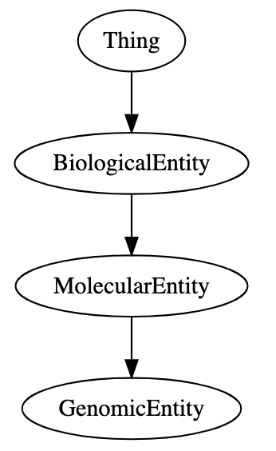
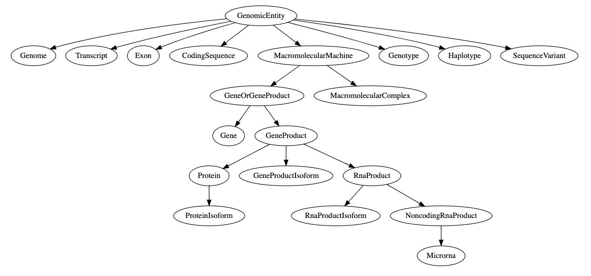
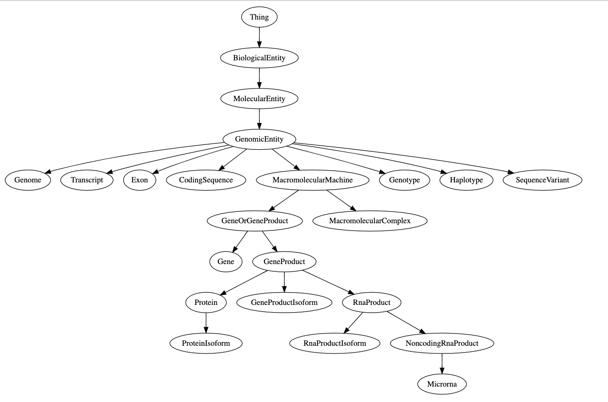

.. How to visualize your schema

Visualize Schema
********************

biothings_schema pyton package allows you to visualize your own schema.

.. _visualize_full_schema:

Visualize the Full Schema as a Tree
-----------------------------------

.. code-block:: python

    In [1]: from biothings_schema import Schema

    In [2]: schema_url = 'https://raw.githubusercontent.com/data2health/schemas/biothings/biothings/biothings_curie_kevin.jsonld'

    In [3]: se = Schema(schema=schema_url)

    In [4]: se.full_schema_graph()

    # A tree structured graph of your schema would be displayed

.. _visualize_ancestors:

Visulize the ancestors of a specific class
------------------------------------------

biothings_schema python package also accepts URL as its input. The data loaded from the URL must be either a JSON document or a YAML document.

.. code-block:: python

    In [1]: se.sub_schema_graph(source='GenomicEntity', include_children=False, include_parents=True)

.. _visualize_descendants:

Visulize the descendants of a specific class
--------------------------------------------

.. code-block:: python

    In [1]: se.sub_schema_graph(source='GenomicEntity', include_children=True, include_parents=False)

.. _visualize_full_ancestry:

Visulize the full ancestry of a specific class
----------------------------------------------

.. code-block:: python

    In [1]: se.sub_schema_graph(source='GenomicEntity', size="9,6")

